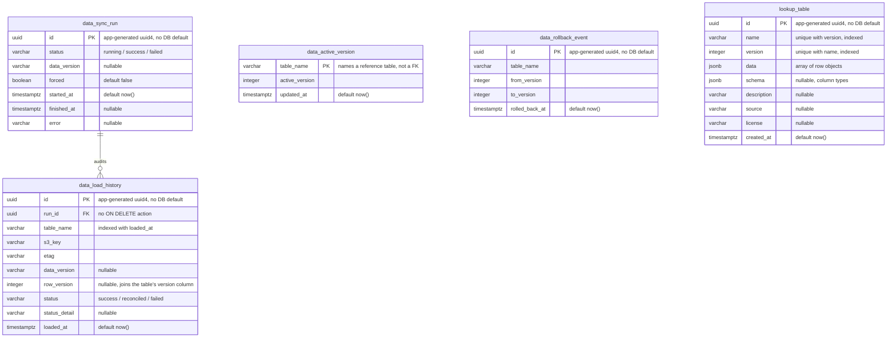
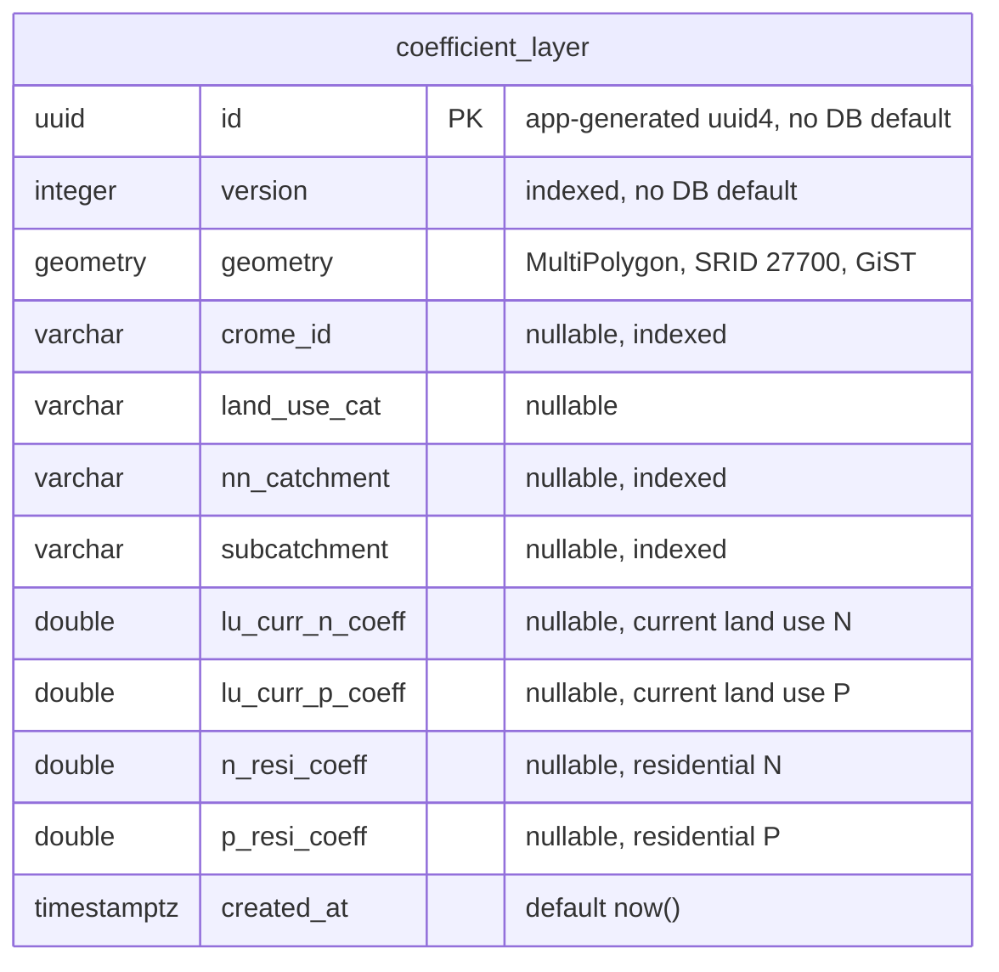
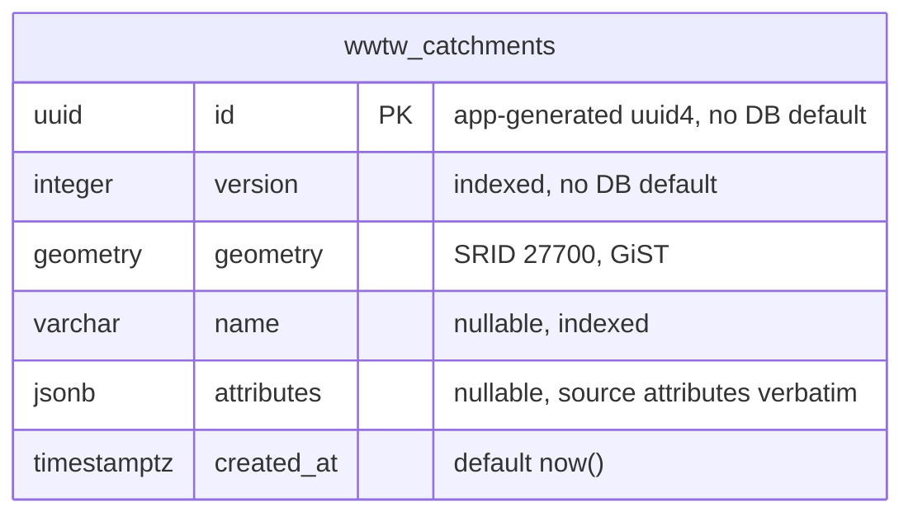

# Reference database ERD

Entity-relationship diagram of the impact-assessor **`nrf_impact`** Postgres
database — the spatial reference layers used for impact assessment, the JSONB
lookup tables, and the audit trail for the S3-driven data sync that loads them.

- **Source:** live `nrf_impact` Postgres (`docker compose` service `postgres`),
  schema `public`, cross-checked against the Alembic revisions under
  `alembic/versions/`.
- **Generated:** 2026-08-13, by the `generate-db-diagram` skill.
- **Scope:** application domain tables only. `alembic_version` and PostGIS
  internals (`spatial_ref_sys`, `geometry_columns`, `geography_columns`) are
  excluded.

This database has **no foreign keys to `nrf_backend`** — the two databases share
a Postgres instance but are otherwise independent. The services talk over HTTP
and SNS/SQS.

Geometry columns are **SRID 27700** (British National Grid) with GiST indexes.
Reference data is **versioned rather than replaced**: a sync loads a new
`version` alongside the old, and `data_active_version` decides which one reads
should use.

## Data management

The only foreign key in this database is `data_load_history.run_id`.

Reads fall back to `MAX(version)` when `data_active_version` holds no row for a
table, so it only gains one once a reload or rollback has actually run.

## Spatial reference layers

`coefficient_layer` has its own column set — the per-parcel nutrient
coefficients the levy calculation multiplies through, and by far the largest
table (~5.4M polygons).

The remaining **nine** layers share one identical column set. It is drawn once,
on `wwtw_catchments`:

| Table | Holds |
| --- | --- |
| `wwtw_catchments` | Wastewater treatment works catchment polygons |
| `lpa_boundaries` | Local planning authority boundaries |
| `nn_catchments` | Nutrient neutrality catchment polygons |
| `subcatchments` | Sub-catchment polygons |
| `gcn_risk_zones` | Great crested newt risk zones (red/amber/green) |
| `gcn_ponds` | National ponds dataset, for GCN assessment |
| `edp_edges` | Environmental designation polygon edges, for GCN assessment |
| `edp_boundary_layer` | EDP boundary polygons |
| `edp_excluded_areas` | Buffered SSSI exclusion polygons (nutrient EDP) |

These carry no foreign keys — they are independent reference layers, joined
spatially at query time.

## Constraints and indexes worth knowing

| Name | Rule |
| --- | --- |
| `uq_data_sync_run_single_running` | Partial `UNIQUE (status) WHERE status = 'running'` — enforces a single in-flight sync. |
| `uq_lookup_name_version` | `UNIQUE (name, version)` — one row per lookup table per version. |
| `ix_public_coefficient_layer_geom_v1` | Partial GiST over `geometry WHERE version = 1`. **Add an equivalent when loading a new version**, or queries against it lose the index. |
| `ix_data_load_history_table_loaded_at` | `(table_name, loaded_at)` — the provenance lookup. |
| `ix_public_<layer>_geometry` | GiST on every spatial layer. |

## UUID primary keys have no database default

Every `uuid` primary key here is `default=uuid4` in SQLAlchemy — applied in
**Python**, not by Postgres (see `app/models/db.py`). `information_schema`
therefore reports no default, and a raw `INSERT` that omits the id will fail.
The same applies to `version`, which the models default to `1`.

## Two migration definitions

The schema is defined twice: **Alembic** (`alembic/versions/`, run locally) and a
parallel **Liquibase** changelog (`changelog/`, applied on the deployed
platform). `scripts/check_migration_parity.py` enforces that every Alembic
revision has a matching Liquibase changeset. The live database reflects whichever
ran — this diagram is the same either way.
